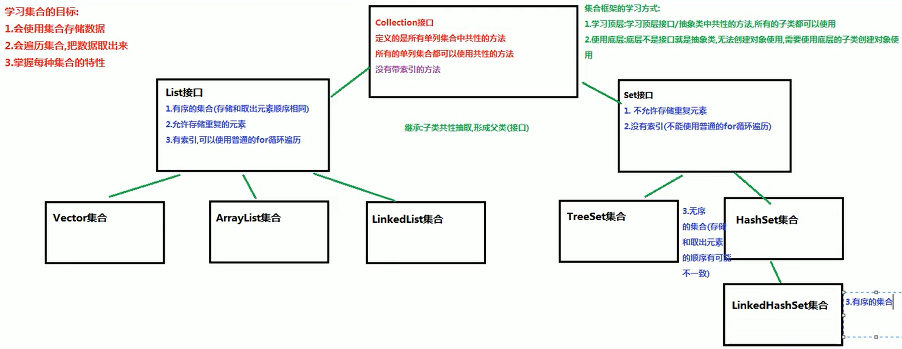

## 类型转换
对于`byte`/`short`/`char`三种类型来说，如果右侧赋值的数值没有超过范围，会自动强制类型转换
`byte`/`short`涉及到运算会自动提升为`int`类型

## 变量赋值
赋值时，若右侧表达式中都是常量，编译时就会直接计算出结果

## 文件层次
项目 -> 模块 -> 包 -> 文件

## 函数定义
1. 定义顺序无关
2. 方法定义不能嵌套
3. 定义在类中
4. return的返回值必须与定义的方法类型一致
5. 对于一个void么有返回值的方法，不写return后面的返回值

## 函数重载
### 方法重载与下列因素相关
1. 参数不同
2. 参数类型不同
3. 参数的多类型顺序不同

### 方法重载与下列因素无关
1. 与参数名无关
2. 与返回值类型无关

## 数组
### 概念
一个容器，可以存放多个数据值

### 特点
1. 引用类型
2. 数组元素的类型必须统一
3. 数组长度在程序运行期间不可改变

### 两种常见的初始化方式
1. 动态初始化（指定长度）
2. 静态初始化（指定内容）

#### 动态初始化基本格式
`数据类型[] 数组名称 = new 数据类型[数组长度]`

#### 默认值
动态初始化数组时，其中元素会自动拥有一个默认值，默认规则如下：
1. 整数类型，默认为0
2. 浮点类型，默认为0.0
3. 字符类型，默认为'\u0000'
4. 布尔类型，默认为`false`
5. 引用类型，默认为`null`

#### 静态初始化基本格式
`数据类型[] 数组名称 = new 数据类型[] { 元素1， 元素2 }`

### 注意事项
1. 静态初始化没有给长度，但会自动推算长度
2. 静态初始化标准格式可以拆分成两个步骤
3. 动态初始化也可以分为两个步骤
4. 静态初始化一旦使用省略模式，就不能拆分成两个步骤了

## `Java`内存
分为五个部分：
1. 栈（stack）：存放的都是方法中的局部变量，方法运行一定要在栈中
   局部变量：方法的参数，或者是方法{}内部的变量
   作用域：一旦超出作用域，立刻从栈内存中消失
2. 堆（Heap）：凡是`new`出来的东西，都在堆中
   堆内存里面的东西都有一个地址值：16进制
   堆内存里面的数据，都有默认值，规则：
    整数    默认为0
    浮点数  默认为0.0
    字符    默认为'\u0000'
3. 方法区（Method Area）：存储class相关信息，包含方法的信息。
4. 本地方法栈（Native Method Stack）；与操作系统相关
5. 寄存器（pc Register）：与CPU相关

## 类
### 成员变量
   ```java
   String name;   // 姓名
   int age;       // 年龄
   ```
### 成员方法
   ```java
   public void eat() {

   }
   ```

### 使用类的步骤
1. 导包，也就是指出需要使用的类在哪儿（在同一个包下的类可以省略导包语句）
2. 通过`new`创建类
3. 用，`.`运算符使用
成员变量没有赋值，将会有一个默认值，规则和数组一样

### 局部变量和成员变量
1. 定义的位置不一样
   局部变量：方法内部
   成员变量：方法外部，直接写在类中
2. 作用范围不一样
   局部变量：只有方法中可以使用，出了方法不再使用
   成员变量：整个类都可以通用
3. 默认值不一样
   局部变量：没有默认值，如果想使用，必须进行手动赋值
   成员变量：如果没有赋值，会有默认值，规则与数组一样
4. 内存的位置不同
   局部变量：跟着方法走，位于栈内存
   成员变量：在创建对象时创建成员变量，位于堆内存
5. 生命周期
   局部变量：跟着方法走，随着对象出栈而消失
   成员变量：随着对象创建而诞生，随着对象被垃圾回收而消失

## 面向对象
### 三大特性
封装、继承、多态

### 访问`private`变量
定义一对`Getter/Setter`方法

必须叫`setXXX`或者`getXXX`命名规则
`boolean`类型的`get`应该用`isXXX`

### `this`
通过谁调用的方法，谁就是`this`

### 构造方法
1. 方法名称与类名一致（包括大小写）
2. 构造方法没有返回值类型
3. 构造方法不能return值
4. 没有构造方法，默认会添加
5. 有自编写构造函数，不会再使用默认的构造方法

### 标准类的四个组成部分
1. 所有成员变量都使用`private`修饰
2. 每个变量都编写一对`Setter/Getter`方法
3. 编写一个无参数的构造方法
4. 编写一个全参数的构造方法

## api
### `Scanner`
`Scanner`类的功能，可实现键盘输入数据到程序

### 引用类型的一般步骤：
1. 导包（`java.lang`包下面的内容不需要导包，可以直接使用）
2. 创建
   类名称 对象名 = new 类名称
3. 使用
   对象名.成员方法名

### `ArrayList`
`ArrayList`使用时，跟着一个尖括号表示泛型，如一个`String`类型的`ArrayList`，可以通过`ArrayList<String>`来表示

对于`ArrayList`来说，直接打印得到的不是地址值，而是内容

### 包装类与基本类型的对照
| 基本类型 | 包装类    |
| -------- | --------- |
| byte     | Byte      |
| short    | short     |
| int      | Integer   |
| long     | Long      |
| float    | Float     |
| double   | Double    |
| char     | Character |
| boolean  | Boolean   |

## 字符串
### 字符串常量池
`new`的不在常量池中
直接赋值的字符串在常量池中

### 字符串中的常用方法
`equals`: 内容是否相等，推荐使用一个字面量字符串.equals(字符串变量)
`concat`: 不改变原字符串，返回一个全新的结果
`toCharArray`: 将当前字符转换为一个`char`类型数组
`getBytes`: 获取字符串对应的`char`类型数组的`bytes`类型数组

### 静态代码块
+ 静态代码总是优先于动态代码块执行，静态代码块比构造代码先执行
+ 静态代码执行唯一的一次

### Arrays
+ `toString`
+ `sort`
  1. 如果是数值，从小到大
  2. 如果字符串，默认按字母升序
  3. 如果是自定义类型，需要有`Comparable`接口

### Math
+ `ceil` （取整的结果是一个`double`类型值，但`double`类型可以++）
+ `floor`
+ `round`

## 继承
### 继承关系的特点
1. 子类可以拥有父类的“内容”；
2. 子类还可以拥有自己专有的

### 父类、当前类、成员变量重名
+ 直接访问（成员变量）
+ `this.成员变量` （当前类）
+ `super.成员变量` （父类）

### 重写 & 重载
+ 重写 —— 方法名称，参数列表均相同
+ 重载 —— 方法名称相同，参数列表不同

#### 方法覆写的注意事项
1. 必须保证父子类之间的方法名称相同，参数列表也相同；
2. 子类方法的返回值必须小于等于父类方法的返回值范围；
3. 子类方法的权限必须大于等于父类方法的权限修饰符。
   `public` > `protected` > (`default`) > `private`
   `default`指关键字什么都不写

#### 重写检测
`@Override`: 写在方法前面，检测是否为有效重载

### 继承关系中父子构造函数
1. 子类构造函数中，会默认调用一个`super()`方法，以调用父类的构造函数；
2. 父类构造函数中，不再有默认，需要手动`super(args)`传入参数；
3. 只有子类构造方法才能调用父类构造方法，其他方法中不能调用`super()`；
4. 父类调用必须在构造函数的第一个语句

### 关键字`this`
1. 访问成员变量
2. 访问成员函数
3. 访问本类的另一个构造方法
   注意：`this(...)`调用的构造方法必须是第一个；`super`和`this`两种构造方法，只能用一个。

### Java特点
1. Java语言是单继承的
2. Java语言可以多级继承
3. 一个子类只能有一个父类，一个父类可以有多个子类

### 抽象方法
1. 在方法前加上`abstract`关键字就行修饰;
2. 抽象方法所在类必须为抽象类;

## 接口
接口就是一种多个类的公共规范

### 接口的编译
接口编译后生成的字节码文件仍然是：.java -> .class

### 接口中可以包含的内容
1. 常量     （Java7）
2. 抽象方法 （Java7）
3. 默认方法 （Java8）
   默认方法可以有方法体，接口中的默认方法，可以解决接口升级的问题，升级接口添加的默认值可以直接在创建的子类中使用
   ```java
   public default 返回值类型 方法名称(参数列表) {
      方法体
   }
   ```
4. 静态方法 （Java8）
5. 私有方法 （Java9）
   1. 普通私有方法：解决多个默认方法之间重复代码问题
   2. 静态私有方法：解决多个静态方法之间重复代码问题

### 接口的使用
1. 必须要有`实现类`实现`接口`
   ```java
   public class ClassName implements InterfaceName {

   }
   ```
2. 接口的实现必须覆盖重写（实现）接口中的所有抽象方法
3. 创建实现类的对象进行使用

### 接口中常量的定义
一旦赋值，不能修改
```java
public static final int contantInt = 10;
```

#### `final`
一旦使用`final`关键字进行修饰，说明不可改变

### 注意事项
1. 接口是没有静态代码块或构造方法的;
2. 一个类可以实现多个接口
3. 如果实现类的所实现的接口中存在重复方法，只需要覆盖一次即可
4. 如果实现类的所实现接口中存在重复默认方法，必须进行覆盖处理
5. 一个类如果是直接父类中的方法，和接口当中默认方法产生了冲突，优先使用父类当中的方法

### 接口继承
1. 多个父接口当中的抽象方法如果重复，没有关系
2. 多个接口中的默认方法如果重复，必须进行重写。【重写带着default关键字】

## 多态
父类引用指向子类对象
格式：
父类对象 对象名 = new 子类名称();
或者：
接口名称 对象名 = new 实现类名称();

### 通过父类定义的对象名访问方法和成员变量
+ 访问方法看`new`, `new`谁调用的就是谁
+ 访问变量看等号左边，左边是谁，优先是谁，没有则向上找

### 对象转型
+ 向上转型（多态写法）—— 向上转型一定安全，因为是从小范围 -> 大范围
+ 向下转型 （还原）
  ```java
  子类名称 对象名 = (子类名称) 父类对象名;
  ```

## `final`
1. 修饰类 —— 修饰后类不会有任何子类
2. 修饰方法 —— 子类不能再覆盖重写
3. 修饰局部变量 —— 局部变量为常量
4. 修饰成员变量 —— 与局部变量相比，有默认值，所以使用`final`即需要手动赋值，构造函数中也可以进行赋值
对于子类、方法来说，`abstract`关键字和`final`关键字不能同时使用，因为矛盾

## 四种权限修饰符
|              | public | protected | (default) | private |
| ------------ | ------ | --------- | --------- | ------- |
| 同一个类     | YES    | YES       | YES       | YES     |
| 同一个包     | YES    | YES       | YES       | NO      |
| 不同包子类   | YES    | YES       | NO        | NO      |
| 不同包非子类 | YES    | NO        | NO        | NO      |

## 内部类
1. 成员内部类
2. 局部内部类
内用外，随意访问，外用内，需要借助内部对象

### 内部类的使用
1. 间接方式：在外部类的方法中使用内部类，然后通过调用外部类的方式使用
2. 直接访问，格式：
   ```java
   外部类名称.内部类名称 对象名 = new 外部类名称().new 内部类名称();
   ```
### 命名冲突
内部类访问外部类的重名变量：
`外部类.this.变量名`

### 局部内部类
只有当前所属的方法才能使用

### 类的权限修饰符
public > protected > (default) > private
定义一个类时，权限修饰符规则：
1. 外部类：public / (default)
2. 成员内部类：public / protected / (default) / private
3. 局部内部类：什么都不能写，因为只能所属方法才能访问

### 匿名内部类
1. 适用场景 —— 接口或抽象类只需要实现一次

### 注意事项
1. 匿名内部类只会在创建对象时调用一次;

## DateFormate
抽象类，常用实现的类`SimpleDateFormate`

## StringBuilder
字符串缓冲区，可以提高字符串的操作效率
底层也是一个数组，但没有被`final`修饰，但字符串是被`final`修饰的，因此字符串加法中，会存在多个字符串，影响效率

## `Collection`架构


### `Collection`常用功能
+ `add`
+ `clear`
+ `remove`
+ `contains`
+ `isEmpty`
+ `size`
+ `toArray`

### `Iterator`迭代器
取出元素的一种通用方法，是一个接口，无法直接使用，需要使用`Iterator`接口的实现类对象
+ `boolean hasNext()` —— 如果仍有元素可以迭代，则返回`true`
+ `next` —— 取出元素中的下一个元素

### 使用步骤
1. 使用集合中的方法`iterator()`获取迭代器的实现类对象，使用`iterator`接口接受;
2. 使用`iterator`接口中的方法`hasNext()`判断是否可以继续迭代;
3. 使用`iterator`接口中的`next`方法获取集合中下一个元素

## 泛型
+ `E` —— element元素
+ `T` —— type 类型

### 含有泛型的类
```java
public class Test<E> {}
```

### 含有泛型的函数
```java
public <E> void print(E e1, E e2) {}
```

### 通配符
一般不知道接收的类型应该是哪个，选`?`作为通配符接收，一般泛型是没有继承概念的

### 上限及下限
+ `泛型的上限限定`: ? extends E —— 代表使用的泛型只能是E类型的子类/自身
+ `泛型的下限限定`: ? super E —— 代表使用的泛型只能是E类型的父类/自身

## 数据结构
### 红黑树
特点：趋近于平衡树，查询的速度非常快，查询叶子节点最大次数和最小次数不能超过二倍

#### 约束
1. 节点可以是红色或者黑色的;
2. 根节点是黑色的;
3. 叶子节点(空节点)是黑色的;
4. 每个红色的节点的子节点都是黑色的;
5. 任何一个节点到其每个叶子节点的路径上黑色节点相同。

## `Collection`
### `List`特点
1. 有序的集合;
2. 索引：包含一些索引的方法;
3. 允许存储重复元素.

### `ArrayList`与`LinkedList`对比
`ArrayList`底层为数组实现，查询快，增删慢
`LinkedList`底层为链表实现，增删快，查询慢

### `Set`特点
1. 无序集合;
2. 没有索引;
3. 不允许重复元素.

#### `HashSet`的特点
1. 不允许存储重复元素;
2. 没有索引，没有带索引的方法，无法使用普通for循环进行遍历;
3. 无序，存取顺序可能不一致;
4. 底层通过哈希表实现.

### `HashSet`底层实现原理
`Set`集合在调用`add`方法时，`add`方法会调用元素的`hashCode`方法和`equals`方法，判断元素是否重复

### `LinkedHashMap`与`HashMap`的区别
`LinkedHashMap`存储的数据是有序的

## 可变参数
当方法的参数列表已经确定，参数的个数不确定，就可以使用可变参数